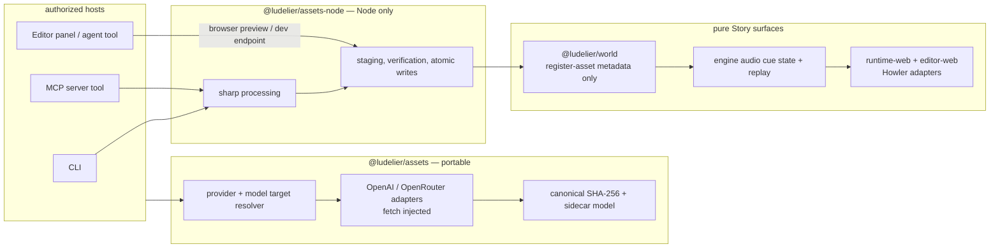

# P3 — Multi-provider AI assets, provenance, and deterministic audio

## Problem frame

P1 can render committed images, but image creation is a manual OpenAI shell script and there is no audio model, playback, provenance, or agent-capable asset workflow. P3 makes generated asset bytes an authoring-time, reviewable input: a human or authorized agent can generate, inspect, persist, register, replay, and disclose assets without bypassing Story validation or the deterministic engine.

The prior P3 draft was directionally correct but unsafe to execute unchanged. This revision closes six design blockers before implementation: model-level capability routing, host-only side effects, a real cache/write protocol, public-versus-private provenance, host-injected agent tools, and lossless audio cue semantics.

---

## Scope and boundaries

### In scope

- OpenAI image generation and TTS; OpenRouter image generation.
- BYOK per provider, model-level capability checks, explicit provider/model overrides, and deterministic configured preference order.
- A portable `@ludelier/assets` provider/provenance seam and Node-only `@ludelier/assets-node` processing/persistence adapter.
- Schema metadata for image/audio assets plus generated-content disclosure; `sound` and `stop-sound` Story statements.
- Deterministic audio state and replay coverage; Howler presentation adapters in the runtime and editor, never in the engine or Pixi renderer.
- CLI and MCP generation/listing; an editor asset panel, preview/export, dev-only persistence path, and host-injected agent generation tool.
- Public disclosure metadata plus private, committed provenance records; hermetic tests and a manually gated BYOK smoke path.

### Explicit non-goals

- No generation task, provider call, cache, filesystem write, `sharp` import, or secret handling in `@ludelier/world`. World remains pure Story-data manipulation and only registers/validates metadata.
- No fal.ai, ElevenLabs, OpenRouter TTS, custom OpenAI voices, cloud storage, metering, object storage, or P4 gateway work.
- No implicit opaque fallback for a transparent request; no legacy OpenAI image model as a default or fallback.
- No advanced audio mixing, ducking, spatialization, backlog, save slots, or generic asset authoring DSL.

---

## Review decisions

### KTD1 — Preserve the world boundary

`@ludelier/world` remains pure and validates only Story metadata through `register-asset`. It gains `kind`, `generated`, and media-reference validation but never sees API keys, provider slugs, byte buffers, sidecars, cache state, or host paths. Generation hosts call the existing metadata edit chokepoint only after their byte write has succeeded.

### KTD2 — Resolve a provider *and model target*, not a provider-wide boolean

An asset provider exposes coarse modalities; a target profile carries the actual model/modality constraints: supported media kind, output formats, alpha/background support, size policy, quality/seed support, and TTS voices/formats/limits. Resolution returns an effective `{ providerId, modelId, parameters }` target. Explicit provider/model overrides are validated by the same rule and fail before any paid request when incompatible.

Configured provider order is explicit. OpenRouter image target data is refreshed from its documented image model/endpoint discovery APIs and cached by the provider; target selection does not infer support from a provider-wide `transparentBackground` flag or a model-level union. The direct OpenAI default is the current opaque `gpt-image-2` profile. Retiring `gpt-image-1` / `gpt-image-1.5` profiles are never defaults; a transparent request succeeds only when a configured, currently supported model target advertises alpha-capable background support.

### KTD3 — Portable core; Node-only processing and writes

`@ludelier/assets` is browser/headless-safe: types, target resolution, fetch-injected provider adapters, canonical hashing, sidecar model/parser, and normalized errors. It has no filesystem, `sharp`, Node built-in, DOM, or ambient-key responsibility.

`@ludelier/assets-node` owns `sharp`, SHA-256 file verification, controlled path construction, temp-file staging, and atomic renames. CLI, MCP, and the editor's Vite dev middleware import this Node-only package. Browser editor code imports the portable core only and can preview generated blobs; static deployments export prepared artifacts via a user gesture rather than falsely claiming source-tree writes.

### KTD4 — Provenance is deployment-private-by-default; disclosure is Story metadata

A deployment-private sidecar contains the resolved provider/model, non-secret request descriptor, prompt hash, optional reported or clearly labelled estimated cost, request hash, final-byte SHA-256, MIME, extension, byte size, created time, and post-processing recipe/version. Exact prompt text participates in the request hash but is not persisted. Sidecars never contain API keys, authorization headers, raw provider bodies, raw diagnostics, or an unredacted prompt.

Sidecars are committed under a non-public, non-Vite-served provenance root, separate from `runtime-web/public/assets`; repository visibility is not treated as confidentiality. The Story carries only runtime-safe metadata: `kind`, `generated`, and the resulting asset URL. The player can show generic generated-asset attribution and the required voice disclosure when a generated audio asset is used by a `sound` statement on the `voice` channel. Sidecars are never scraped at runtime.

### KTD5 — Cache integrity and write contract are explicit

The cache key is a versioned canonical SHA-256 payload over the resolved provider/model and sanitized fixed vendor origin/path, exact effective request, media role, output format, and post-processing recipe/version. It rejects URL userinfo/query/fragment and never persists a credential-bearing endpoint. It is not the engine's FNV state hash. A hit requires both matching request hash and a rehash of the final persisted bytes against the sidecar content hash.

Hosts preflight Story validity, slug id, controlled destination, and existing metadata before vendor I/O. They stage processed bytes and sidecar to same-directory temporary files, validate output, rename both into place, then atomically persist the Story metadata. A Story is never written to reference absent bytes. If the final Story write fails, the resulting asset/sidecar is a safe orphan that `asset ls` can identify and a retry can register without re-spending. `--force` bypasses a verified cache hit only; it never makes duplicate metadata valid. A client-side abort or post-dispatch network failure is reported as potentially chargeable and is never automatically replayed.

### KTD6 — Audio is a deterministic cue stream, not three scalar ids

`GameState.audio` has desired persistent music/voice state plus a monotonically sequenced, bounded-per-reducer-run event list. `sound` emits a play event; repeated SFX and multiple cues before one blocking statement remain individually observable. `stop-sound` emits a stop event and clears the relevant desired persistent state. Music defaults to looped playback; voice and SFX default to one-shot playback. The ambiguous `once` field is removed.

The engine deterministically resets the transient event list at the start of each subsequent reducer resolution; no presentation acknowledgement enters engine state, and hosts render the prior state before dispatching the next action. It retains an increasing sequence and includes logical audio state in `Simulation` hashing/replay. Browser playback is activated by the first trusted player gesture: the adapter queues only the current desired looping music until activation, then synchronizes it; it deliberately drops historical SFX/voice events rather than playing stale sounds. `exploreStory` deliberately excludes presentation-only cue history from its deduplication key so audio events cannot prevent finite exploration.

### KTD7 — Paid generation is an authorized host capability

`@ludelier/authoring` gains a generic asynchronous `AgentTool` composition seam. World tools remain registry-derived; host tools carry their own schema, side-effect metadata, authorization, handler, compact redacted result, and progress event. `generate-asset` is injected by CLI/MCP/editor hosts and is never a world task.

CLI human generation is explicit. MCP advertises generation only when launched with asset generation enabled. The editor exposes it to chat only after the user enables paid generation for the session; browser keys stay memory-only by default and never enter sidecars, logs, transcript payloads, IndexedDB holds, or download names. A static editor can prepare a draft and require a human download gesture; dev mode can use a same-origin, root-contained Vite endpoint to persist approved bytes.

---

## Directional architecture

This illustrates intended boundaries, not implementation code.

---

## Requirements and acceptance contracts

- **R1 — Portable provider seam.** Configured OpenAI/OpenRouter providers expose model targets and resolve a compatible target deterministically. Explicit incompatible provider/model requests fail before network I/O.
- **R2 — Provider contracts.** OpenAI GPT Image calls use `/v1/images/generations`, `n: 1`, and decode `b64_json`; OpenAI TTS uses `/v1/audio/speech` and binary response bytes; OpenRouter uses `/api/v1/images`, decodes `b64_json`, and consults endpoint-level capabilities. Fetch, abort, bounded retries, safe error classification, and optional cost/usage are hermetically testable.
- **R3 — Cache/provenance.** SHA-256 request and final-content hashes are versioned, canonical, and secret-free. Cache hits validate both sidecar and bytes; missing/corrupt output is never treated as a hit.
- **R4 — Node asset commit.** Background and sprite roles select documented `sharp` recipes; output bytes/sidecar are staged before Story persistence; all destinations stay under configured roots.
- **R5 — Media-valid Story DSL.** `Asset.kind` defaults to image; `generated` defaults false; scene/show require image assets; sound requires audio assets; reference discovery and generated JSON Schema cover the new statement operations.
- **R6 — Deterministic audio.** Sound/stop semantics preserve repeated cues, replace/stop channels predictably, survive replay, and alter hashes only through logical audio state.
- **R7 — Presentation audio/disclosure.** Runtime and editor filter images before Pixi preload, use a shared browser audio helper, provide mute/volume controls, clean up on unmount, and disclose generated voices from Story metadata.
- **R8 — CLI/MCP hosts.** `asset gen` and `asset ls` implement the transaction/cache/error contracts. MCP exposes a host-level `generate-asset` tool only with explicit authorization and returns redacted structured output.
- **R9 — Agent/editor parity.** Agent tools are host-injected alongside world tools; editor human and agent generation share provider/preview/commit machinery subject to the same authorization and browser gesture limits.
- **R10 — Determinism and safety.** Generation never mutates RNG or calls engine logic; every Story metadata mutation goes through `validateStory`; runtime saves invalidate prior audio-less state.

---

## Implementation units

### U1. Media-aware Story schema and pure world metadata

**Goal:** Make images, audio, generated-content disclosure, and sound statements valid Story data without leaking generation behavior into world.

**Requirements:** R5, R10.

**Dependencies:** None.

**Files:** `packages/schema/src/story.ts`, `packages/schema/src/validate.ts`, `packages/schema/test/schema.test.ts`, `packages/world/src/manipulate/assets.ts`, `packages/world/src/manipulate/statements.ts`, `packages/world/src/understand/references.ts`, `packages/world/test/manipulate.test.ts`, `packages/world/test/understand.test.ts`, `packages/authoring/src/author.ts`, `packages/editor-web/src/storymap/script.ts`, `packages/editor-web/test/script.test.ts`.

**Approach:** Add image/audio kind plus safe `generated` metadata with backwards-compatible defaults. Add sound and stop-sound variants, type-aware id-to-kind cross-reference validation, sound reference discovery, and human/agent descriptions that document the new operations. Keep `register-asset` a pure append/validate operation with expanded metadata only.

**Patterns to follow:** `packages/schema/src/validate.ts` cross-reference pass; `packages/world/src/manipulate/assets.ts`; generic statement handling in `packages/world/src/manipulate/statements.ts`.

**Test scenarios:**
- Legacy assets parse as image/non-generated.
- Scene/show reject declared audio ids; sound rejects declared image ids; each accepts a declared correct-kind id.
- Duplicate media ids and unknown references stay invalid.
- `register-asset` records kind/generated metadata and generic statement forms accept sound/stop without new world generation tasks.
- `find-references` reports sound asset usage; JSON Schema exposes both new discriminants.

**Verification:** Every returned Story is Zod-valid, and no `@ludelier/world` source imports an asset provider, network, Node, or filesystem surface.

### U2. Deterministic engine audio state

**Goal:** Fold complete audio commands into headless game state without dropping same-step SFX or destabilizing exploration.

**Requirements:** R6, R10.

**Dependencies:** U1.

**Files:** `packages/engine/src/state.ts`, `packages/engine/src/reducer.ts`, `packages/engine/src/simulation.ts`, `packages/engine/src/explore.ts`, `packages/engine/test/audio.test.ts`, `packages/engine/test/replay.test.ts`.

**Approach:** Model persistent music/voice desired playback plus ordered play/stop events and monotonic event sequence. Reset only the transient event collection on the next reducer resolution, retain channel replacement/stop semantics, and include logical audio in snapshots. Preserve bounded `exploreStory` behavior by omitting transient presentation event history from its deduplication identity.

**Patterns to follow:** Stage state/reducer semantics in `packages/engine/src/state.ts` and `packages/engine/test/stage.test.ts`; replay contracts in `packages/engine/test/replay.test.ts`.

**Test scenarios:**
- A sound before the first say creates the expected desired state/event.
- Two SFX before one blocking statement yield two ordered events, including repeated asset ids.
- Music/voice replacement and each stop channel behave deterministically.
- Equal story/actions/seed yield equal hashes and recorded audio traces replay; altered audio cues diverge.
- Exploration remains finite for a cyclic story whose only changing values are presentation cue sequences.

**Verification:** Existing non-audio simulations retain behavior; audio state is present in every initial/reduced/simulated GameState shape.

### U3. Portable `@ludelier/assets` core

**Goal:** Add a browser-safe AssetProvider, target resolver, canonical hash/sidecar model, and typed redacted failures.

**Requirements:** R1, R3.

**Dependencies:** U1 only for Story-compatible metadata types; no dependency on world, Node helpers, or authoring.

**Files:** `packages/assets/package.json`, `packages/assets/src/index.ts`, `packages/assets/src/types.ts`, `packages/assets/src/resolve.ts`, `packages/assets/src/provenance.ts`, `packages/assets/src/error.ts`, `packages/assets/test/resolve.test.ts`, `packages/assets/test/provenance.test.ts`, `tsconfig.json`, `packages/editor-web/tsconfig.json`.

**Approach:** Model provider modalities separately from per-model targets. Resolve an effective target from explicit override or configured preference order. Use Web Crypto SHA-256 over a versioned stable payload; preserve exact prompt text and effective parameters. Define a sidecar that distinguishes unavailable, reported, and estimated cost and rejects secrets/raw payloads.

**Patterns to follow:** Provider type/registry conventions in `packages/authoring/src/provider.ts` and `packages/authoring/src/registry.ts`; deterministic serialization in `packages/engine/src/hash.ts` without reusing its non-cryptographic digest.

**Test scenarios:**
- First compatible configured target wins deterministically; explicit incompatible override fails without a provider call.
- Alpha plus JPEG, unsupported seed/size/voice, and deprecated default candidates are rejected locally.
- Equivalent canonical inputs hash identically; a model, prompt, post-process, or format change misses.
- Sidecar round-trips safe metadata, rejects malformed data, and contains no credentials/raw response fields.

**Verification:** The browser/editor build may import the package root without resolving `node:fs`, `sharp`, or a Node-only entrypoint.

### U4. OpenAI and OpenRouter model-target adapters

**Goal:** Implement the verified provider wire contracts, local validation, discovery, retry, and safe error outcomes.

**Requirements:** R1, R2.

**Dependencies:** U3.

**Files:** `packages/assets/src/providers/retry.ts`, `packages/assets/src/providers/openai.ts`, `packages/assets/src/providers/openrouter.ts`, `packages/assets/src/registry.ts`, `packages/assets/test/openai.test.ts`, `packages/assets/test/openrouter.test.ts`, `packages/assets/test/registry.test.ts`.

**Approach:** One `openai` provider owns image and TTS targets. Its default image target is opaque `gpt-image-2`; legacy transparent targets require explicit opt-in and never silently route. OpenRouter discovers/validates endpoint capabilities before target selection and emits only the buffered image endpoint contract. Treat abort after dispatch as potentially chargeable and avoid automatic replay; map moderation, auth, unsupported, retryable, and invalid-response failures to redacted typed errors.

**Patterns to follow:** Injectable fake-fetch and retry tests in `packages/authoring/src/providers/openai-compatible.ts` and `packages/authoring/test/provider.test.ts`.

**Test scenarios:**
- OpenAI request uses correct endpoint/headers/`n:1`, no DALL-E response format, and exact base64 decoding.
- GPT Image 2 rejects transparent and invalid dimensions before fetch; valid opaque constrained size sends expected parameters.
- TTS enforces model/voice/input/speed/format limits and treats returned binary as bytes.
- OpenRouter discovery selects only a target whose endpoint supports transparent background and alpha format; its image response decodes `b64_json` and preserves optional MIME/cost.
- Retry honors safe delay headers where present; 4xx moderation/auth and abort never retry; ambiguous post-dispatch failures carry `mayHaveCharged`.

**Verification:** All provider tests are fake-fetch only; a separately documented manual BYOK smoke remains outside CI.

### U5. Node post-processing and transactional asset persistence

**Goal:** Provide the reusable Node host adapter for image processing, cache validation, controlled paths, staging, and recovery-safe writes.

**Requirements:** R3, R4, R10.

**Dependencies:** U3, U4.

**Files:** `packages/assets-node/package.json`, `packages/assets-node/src/index.ts`, `packages/assets-node/src/process.ts`, `packages/assets-node/src/store.ts`, `packages/assets-node/test/process.test.ts`, `packages/assets-node/test/store.test.ts`, `tsconfig.json`.

**Approach:** Keep `sharp` and Node crypto/filesystem imports confined to this package. Make background cover-fit and sprite alpha trim explicit image roles. Verify cache bytes against full sidecar SHA-256, stage temp files in their final directories, rename asset/sidecar before a caller persists Story metadata, and report safe orphans rather than writing a broken Story reference.

**Patterns to follow:** Atomic story rename in `packages/cli/src/mcp.ts`; asset conventions in `.agents/skills/image-generation/SKILL.md`.

**Test scenarios:**
- Fixture bytes become WebP with the requested cover-fit or trim treatment.
- Path traversal and conflicting Story metadata fail before provider spend; malformed, mismatched, or corrupt provider/cache output fails after dispatch with a redacted potentially-chargeable outcome and no Story mutation.
- Valid cache hit requires matching bytes and can be reused to register absent Story metadata.
- Write failure leaves no Story mutation; a final caller persistence failure leaves only discoverable orphan files.

**Verification:** Node-only imports are unreachable from portable/browser builds; staged assets and sidecars never replace a valid target with partial bytes.

### U6. Host-injected agent tool composition

**Goal:** Let authorized hosts expose generation beside world tools without weakening world purity.

**Requirements:** R9.

**Dependencies:** U3; U1 for metadata operation semantics.

**Files:** `packages/authoring/src/tools.ts`, `packages/authoring/src/run.ts`, `packages/authoring/src/index.ts`, `packages/authoring/test/run.test.ts`, `packages/editor-core/src/index.ts`, `packages/editor-core/test/session.test.ts`.

**Approach:** Add an async `AgentTool` interface with unique definition/schema, effect metadata, authorization-aware handler, redacted result, and progress event. Compose it after world-derived tools but before `done`; reject name collisions. Keep authoring generic: it accepts injected handlers and never imports a concrete asset provider. Forward tools through `EditorSession.chat` while preserving the run lock and edit-log ownership.

**Patterns to follow:** `worldTools`/`dispatch` in `packages/authoring/src/tools.ts`; scripted tool-run tests in `packages/authoring/test/run.test.ts`.

**Test scenarios:**
- A host tool appears alongside world tools, is awaited, and returns a transcript-safe result.
- World/host/done name collisions fail deterministically.
- Host failure/approval-required outcome reaches the model without a Story mutation.
- A host tool may register metadata through the supplied edit log while the session run lock remains active.

**Verification:** `generate-asset` remains absent from `createWorld().describe()` and has no implementation in `packages/world`.

### U7. CLI and MCP asset hosts

**Goal:** Deliver authoritative filesystem generation/listing and an explicitly authorized MCP generation surface.

**Requirements:** R4, R8, R9, R10.

**Dependencies:** U1, U3–U6.

**Files:** `packages/cli/package.json`, `packages/cli/src/assets.ts`, `packages/cli/src/index.ts`, `packages/cli/src/mcp.ts`, `packages/cli/test/assets.test.ts`, `packages/cli/test/mcp.test.ts`.

**Approach:** Add `asset gen` and `asset ls`, configurable controlled public/provenance roots, provider config from environment, cache/force handling, and compact provenance/cost output. Reuse the Node adapter transaction and existing Story persister. MCP adds `generate-asset` as a server-level tool only when an explicit launch option authorizes paid generation; it performs the same preflight, storage, metadata registration, and persistence path.

**Patterns to follow:** CLI temp-directory tests in `packages/cli/test/world.test.ts`; MCP server extras and atomic persistence in `packages/cli/src/mcp.ts`.

**Test scenarios:**
- Mock provider generation writes final bytes/private sidecar and validates the resulting Story metadata.
- Cache hit avoids provider invocation; force is visibly charge-risking; conflicts fail before fetch.
- Listing detects normal, orphaned, missing, and corrupt cache states.
- MCP tool is absent by default, present with authorization, returns redacted data, and never writes after invalid metadata/failed provider output.

**Verification:** A CLI or MCP failure never leaves a Story pointing at missing data; provider credentials never appear in stdout, MCP content, sidecars, or errors.

### U8. Runtime and editor audio presentation

**Goal:** Play deterministic audio cues in browser hosts while preserving image rendering, save safety, and disclosure.

**Requirements:** R7, R10.

**Dependencies:** U1, U2.

**Files:** `packages/audio-web/package.json`, `packages/audio-web/src/index.ts`, `packages/audio-web/test/player.test.ts`, `packages/runtime-web/package.json`, `packages/runtime-web/src/main.ts`, `packages/runtime-web/src/save.ts`, `packages/runtime-web/vite.config.ts`, `packages/runtime-web/e2e/play.spec.ts`, `packages/editor-web/package.json`, `packages/editor-web/src/PlayCanvas.tsx`, `packages/editor-web/test/PlayCanvas.test.tsx`, `tsconfig.json`, `packages/editor-web/tsconfig.json`.

**Approach:** Add a small browser-only shared Howler adapter, kept outside `renderer-pixi`. It tracks sequences, mixes SFX, replaces/stops music and voice, initializes desired persistent state on restore, and cleans up on host unmount. Editor preview rebuilds are restore/reconcile operations: they suppress replayed historical SFX/voice even when a new Simulation restarts its sequence, while reconciling changed desired music/voice. Runtime/editor call Pixi preload with image assets only, map audio sources separately, and expose accessible mute/volume/disclosure controls. Bump `SAVE_VERSION` and add audio extensions to the runtime PWA cache list.

**Patterns to follow:** Paired runtime update lifecycle in `packages/runtime-web/src/main.ts` and editor preview lifecycle in `packages/editor-web/src/PlayCanvas.tsx`; Pixi preload contract in `packages/renderer-pixi/src/renderer.ts`.

**Test scenarios:**
- Adapter plays each new same-step SFX once, replaces music/voice, honors stop, suppresses historical SFX on restore, and reconciles music/voice across an editor preview rebuild with restarted cue sequence.
- Runtime/editor only pass image assets to Pixi preload.
- Legacy Dexie state is invalidated by the save version bump.
- Generated voice used by a voice sound cue yields accessible disclosure; ordinary/imported audio does not.
- Browser smoke remains muted and rendering stays functional with declared audio assets.

**Verification:** No `howler` import reaches engine, world, or renderer-pixi; renderer failures do not alter deterministic simulation state.

### U9. Editor asset panel, dev persistence, and authorized agent path

**Goal:** Give human and agent editors the same provider/preview/commit capability within browser security limits.

**Requirements:** R2, R4, R8, R9.

**Dependencies:** U1, U3–U6, U8.

**Files:** `packages/editor-web/src/assets/AssetPanel.tsx`, `packages/editor-web/src/assets/host.ts`, `packages/editor-web/src/assets/model.ts`, `packages/editor-web/src/assets/AssetPanel.test.tsx`, `packages/editor-web/src/App.tsx`, `packages/editor-web/src/styles.css`, `packages/editor-web/vite.config.ts`, `packages/editor-web/e2e/editor.spec.ts`, `packages/editor-web/package.json`.

**Approach:** Add an asset inspector panel with provider/target settings, memory-only keys by default, explicit paid-generation enablement, role/kind/prompt controls, preview, abort, and redacted result. The same browser host can be injected into chat as `generate-asset` once authorized. In development, a same-origin endpoint accepts only validated relative asset metadata and bytes, invokes the Node adapter, and returns a controlled public URL; static builds produce a prepared download requiring a user gesture. The panel registers metadata only after successful host persistence or prepares an explicit Story delta for download.

**Patterns to follow:** Current ChatPanel opt-in BYOK behavior in `packages/editor-web/src/App.tsx`; manifest-derived world metadata edits; Vite server configuration in `packages/editor-web/vite.config.ts`.

**Test scenarios:**
- No key/approval prevents a paid call and does not expose the agent tool.
- Successful browser generation displays a preview and redacted provenance; abort/error leaves the Story unchanged.
- Dev endpoint rejects traversal/unapproved destination and commits only controlled paths.
- Static export requires a user action and does not claim a repository write.
- Authorized human and agent both use the same host path to register valid metadata; unauthorized agent receives approval-required feedback.

**Verification:** Browser keys and byte drafts never enter Story JSON, event log, localStorage by default, provenance sidecars, or agent transcript.

---

## Verification strategy

- **Hermetic Vitest:** provider request/response contracts, endpoint/model routing, hash/cache integrity, post-processing, staged writes, Story media validation, audio cue/replay semantics, host-tool behavior, CLI/MCP output, and browser helper behavior.
- **Focused builds/smoke:** package typecheck, affected unit tests, CLI temp-directory generation with fake provider, and editor/runtime build after each dependent unit.
- **Manual BYOK smoke, never CI:** one opaque OpenAI image, one OpenAI TTS response, and one configured OpenRouter image target. Record only redacted outcome/provenance metadata; do not commit secrets or raw responses.
- **Manual BYOK smoke ✅ (2026-07-10):** isolated temporary roots stored and registered one OpenAI opaque WebP image (2,634 bytes), one OpenAI TTS MP3 response (33,792 bytes), and one OpenRouter `sourceful/riverflow-v2.5-fast` opaque JPEG image (7,549 bytes). Redacted inventory reported all three as valid and `validate` accepted the resulting Story. The smoke exposed and then verified OpenRouter's `resolution` dialect and no-`mime_type` image response shape; no prompt, credential, raw response, or generated output was retained in the repository.
- **Browser coverage:** image filtering, disclosure, muted audio-control behavior, and existing visual baseline discipline. Regenerating committed visual assets intentionally requires baseline refresh.

---

## External contract references checked for this revision

- [OpenAI image generation reference](https://developers.openai.com/api/reference/resources/images/methods/generate/)
- [OpenAI image generation guide](https://developers.openai.com/api/docs/guides/image-generation)
- [OpenAI deprecations](https://developers.openai.com/api/docs/deprecations)
- [OpenAI text-to-speech guide](https://developers.openai.com/api/docs/guides/text-to-speech)
- [OpenAI speech endpoint reference](https://developers.openai.com/api/reference/resources/audio/subresources/speech/methods/create/)
- [OpenRouter image generation documentation](https://openrouter.ai/docs/guides/overview/multimodal/images)
- [OpenRouter Images API reference](https://openrouter.ai/docs/api-reference/images)

---

## Deferred implementation-time details

- Exact OpenRouter target catalog values remain dynamic. The adapter validates a configured model against discovered endpoint capability data at runtime; it does not freeze catalog slugs as a product contract.
- The final shape of endpoint-cache lifetime, file lock implementation, and Vite middleware internals follows the host behavior above and current dependency APIs.
- No plan change should add a world generation task, a manual image-alpha workaround, or browser access to the Node-only post-processing entrypoint.
