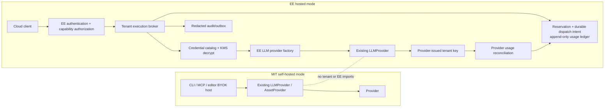

# P4 — Hosted credential broker and metering seam

## Problem frame

P2 and P3 deliberately make self-hosted bring-your-own-key (BYOK) a host concern. `LLMProvider` and `AssetProvider` are vendor-neutral, injected seams; the world, engine, Story data, editor core, and portable asset package do not know credentials, billing, or deployment identity. P3 further binds paid asset generation to an authorized host and prevents raw credentials, prompts, provider bodies, and post-dispatch retries from leaking across its boundaries.

The hosted tier needs a different composition root without changing those contracts: the server must authenticate the actor, derive tenant membership, authorize the requested capability, select a tenant-specific provider credential, reserve spend before dispatch, and reconcile actual provider usage afterward. The provider-issued credential — not a shared account key, request tag, or client-supplied identifier — is the hosted metering boundary.

## Decision

### KTD1 — P4 starts with an EE-owned credential broker, not LiteLLM

The first P4 slice will implement an `/ee`-only hosted credential broker that composes the existing MIT `LLMProvider` seam directly. It authenticates and authorizes server-side, resolves one active `<tenant, provider, credential-version>`, decrypts it only in a short-lived server closure, invokes the existing LLM provider adapter, and emits a safe result plus ledger events.

LiteLLM is **not** adopted as the first P4 gateway. It remains a future, optional EE infrastructure adapter behind the hosted broker; it must never become a dependency of `packages/*`, the source of truth for tenant authorization, or the authoritative billing ledger.

**Why:** LiteLLM offers useful routing, virtual-key, budget, and callback facilities, but introducing it now creates a second authority for tenant access and spend. Its database-backed virtual-key system requires its own PostgreSQL/master-key state, its optional Redis enforcement, and custom-auth/callback integration to preserve Ludelier authority. Custom auth also changes the proxy's normal budget/model checks unless configured carefully. P4's first need is an owned credential/metering boundary, not a second gateway control plane.

### KTD2 — Per-tenant provider credentials are mandatory for hosted providers

Every enabled hosted provider receives exactly one active provider-issued inference credential for a given `<tenant, provider, environment>` at a time. Each attempt pins that credential version. A hosted provider is eligible only if its connector can prove unique credential issuance or assignment, revocation/disablement, provider-side per-credential usage attribution, and reconciliation access.

There is no shared provider-key fallback. A client never selects, supplies, observes, or reuses the hosted credential.

### KTD3 — MIT packages remain self-hosted, portable, and tenant-free

`packages/*` continue to accept only their current provider and host abstractions. They must not import `/ee`, model tenant identity, fetch hosted credentials, persist billing data, or carry cloud gateway fields in Stories, world tasks, provenance, edit logs, or browser payloads.

Self-host CLI, MCP, and browser BYOK continue to construct their direct provider adapters from explicit configuration. Hosted mode is an additional EE composition root, not a replacement path.

### KTD4 — Metering is a reservation-ledger-and-reconciliation workflow

Before any hosted provider dispatch, EE atomically authorizes and reserves the operation using a server-generated idempotency key and pinned credential version. It then durably records a dispatch intent before provider I/O. The ledger distinguishes:

- rejected before dispatch;
- reserved;
- durable dispatch intent;
- confirmed dispatch;
- settled from safe provider usage/cost data; and
- uncertain / may-have-charged.

A repeated idempotency key returns the existing reserved, intent, confirmed, settled, or uncertain operation; it never creates a second dispatch. A crash after provider acceptance but before confirmation leaves the durable intent in an uncertain recovery path, not an automatic retry. Where a provider supports an idempotency header, its capability record requires forwarding the same server-generated operation key; otherwise the durable EE intent is the local duplicate-prevention authority.

Timeouts, client aborts, and network failures after dispatch are not automatically replayed. Reconciliation compares provider-side, per-credential usage with the same credential version. Unmatched usage is quarantined for review; it must never be silently assigned to another tenant.

### KTD5 — Cloud secrets and raw provider material never cross the EE boundary

Credential records are envelope-encrypted with KMS-managed material. Their authenticated encryption context is derived from the server-side tenant, provider, credential identifier/version, and purpose; it contains no key material, prompts, or PII. Plaintext is limited to the EE request worker closure that constructs the existing adapter.

Responses outside that closure are allow-listed projections: operation/correlation identifier, provider/model, status, bounded safe usage/cost fields, and `mayHaveCharged` when applicable. API keys, bearer headers, raw provider request/response bodies, plaintext prompts, and `CompletionResult.raw` never enter browsers, Stories, logs, transcripts, provenance, downloads, or general telemetry.

### KTD6 — Hosted asset execution and storage are deliberately deferred

P4's first broker slice does not offer hosted asset generation, cloud asset persistence, or object storage. P3 asset generation remains a self-hosted workflow. A later EE asset-host plan must define tenant-scoped destinations and URL authorization while preserving P3's artifact-first write, Story-registration, rollback/orphan recovery, controlled destination, and redacted inventory contract; it must not present an object store as a drop-in replacement for `AssetNodeStore`.

## Directional architecture

This illustrates the intended boundaries and data flow. It is directional guidance for review, not implementation specification.

## Scope

### In scope

- A private EE cloud package/composition root that imports MIT provider interfaces but is never imported by them.
- Server-derived tenant authorization for every hosted entry point, including agent tools and future jobs.
- Provider-credential catalog, encrypted credential lifecycle, rotation/revocation, per-credential provider capability validation, and short-lived adapter construction.
- Atomic reservation, append-only operation ledger, reconciliation, redacted audit events, and explicit uncertain-charge handling.
- Hosted LLM execution that preserves existing P2 authorization and redaction while metering every provider completion independently.
- Characterization and cross-tenant tests proving self-host BYOK and hosted mode retain their distinct, safe contracts.

### Explicit non-goals

- No LiteLLM deployment, virtual-key minting, shared-key fallback, or LiteLLM ledger adoption in the first P4 slice.
- No tenant, KMS, billing, or gateway field in `Story`, world tasks, `LLMProvider`, `AssetProvider`, `AgentTool`, portable provenance, or browser persistence payloads.
- No hosted asset generation, cloud asset persistence, or object-store implementation until a separate tenant-scoped asset-host plan proves its transactional and URL-authorization contract.
- No automatic replay after a possibly chargeable provider dispatch.
- No public provider API keys, credential selection controls, raw provider material, or private prompts in client-visible data.
- No implementation of the separate player/editor presentation backlog: save slots, backlog UI, text-speed controls, live viewport resize, transitions, sprite positions, or effects.

## Implementation units

### U1. Establish the EE package boundary and hosted contracts

**Goal:** Introduce a private `ee/cloud` workspace package that is the only home for tenant identity, credential lifecycle, KMS, metering, hosted authorization, and future gateway adapters.

**Requirements:** KTD1, KTD3, KTD5.

**Dependencies:** None.

**Files:** `pnpm-workspace.yaml`; `ee/cloud/package.json`; `ee/cloud/tsconfig.json`; `ee/cloud/src/contracts.ts`; `ee/cloud/src/index.ts`; `ee/cloud/test/boundary.test.ts`; root licensing/build configuration as required.

**Approach:** Define EE-only interfaces for authenticated actor context, tenant-scoped authorization, credential lookup/decryption, provider capability records, operation ledger, audit/outbox, and a hosted LLM execution factory. Add a dependency-boundary check proving EE may import MIT packages but no package may import EE. Preserve P3 asset boundaries as an explicit non-imported concern until the separate asset-host plan.

**Patterns to follow:** Portable provider injection in `packages/authoring/src/provider.ts`; host-only side effects in `packages/cli/src/assets.ts`; P3 boundary decisions in `docs/plans/2026-07-10-001-p3-ai-assets-plan.md`.

**Test scenarios:**

- EE's hosted LLM broker imports `@ludelier/authoring`; no `packages/*` package resolves an EE import.
- A self-host fixture constructs its existing direct BYOK providers without an EE package, tenant record, KMS call, or ledger.
- EE contract results reject unknown/raw provider fields and have no credential-bearing serialization path.

**Verification:** Package graph and hermetic tests prove the commercial boundary is one-way and self-host operation is unchanged.

### U2. Implement tenant credential lifecycle and authorization

**Goal:** Safely resolve one active credential version per authorized hosted provider request.

**Requirements:** KTD2, KTD3, KTD5.

**Dependencies:** U1.

**Files:** `ee/cloud/src/authorization.ts`; `ee/cloud/src/credentials.ts`; `ee/cloud/src/kms.ts`; `ee/cloud/src/provider-capabilities.ts`; `ee/cloud/test/authorization.test.ts`; `ee/cloud/test/credentials.test.ts`.

**Approach:** Derive tenant/resource membership from authenticated server context rather than client IDs. Bind ciphertext encryption context to tenant, provider, credential id/version, and purpose. Require a provider capability record before enablement. Rotation atomically selects a new version for new operations, invalidates resolution caches, and leaves old ciphertext only long enough to settle pinned in-flight operations.

**Patterns to follow:** Explicit provider configuration in `packages/assets/src/registry.ts`; local key closure handling in `packages/assets/src/providers/openai.ts`; host authorization boundaries in `packages/authoring/src/tools.ts`.

**Test scenarios:**

- A tenant-A actor cannot read, rotate, invoke, or infer the existence of any tenant-B credential/resource; denial occurs before KMS/provider I/O.
- Swapping ciphertext or encryption context between tenant/provider/version/purpose fails decryption.
- Two active tenant records cannot reference the same provider credential version.
- Rotation disables new dispatches on the old version while an already-dispatched operation settles against its pinned version.
- A provider without unique credential attribution, revocation, and reconciliation capability cannot be enabled for hosted mode.

**Verification:** Cross-tenant, rotation, and provider-capability tests establish a single server-derived credential selection path.

### U3. Add reservation, usage ledger, audit outbox, and reconciliation

**Goal:** Make provider spend attributable and recoverable without trusting clients or automatic retries.

**Requirements:** KTD2, KTD4, KTD5.

**Dependencies:** U1, U2.

**Files:** `ee/cloud/src/metering.ts`; `ee/cloud/src/ledger.ts`; `ee/cloud/src/audit.ts`; `ee/cloud/src/reconciliation.ts`; `ee/cloud/test/metering.test.ts`; `ee/cloud/test/reconciliation.test.ts`.

**Approach:** Authorize/reserve atomically before dispatch, then persist a durable dispatch intent plus a redacted outbox event in the same transaction. A repeated idempotency key returns the durable operation state without another provider call. Correlate result/usage with a server-generated operation id and pinned credential version. Treat provider-side usage as settlement input, retain explicit uncertain state after an ambiguous dispatch or a crash between provider acceptance and confirmation, and quarantine unmatched reconciliation rows. Forward the idempotency key only through provider capabilities that explicitly support it; do not imply universal vendor idempotency.

**Patterns to follow:** P3 `mayHaveCharged` error model in `packages/assets/src/error.ts`; P3 no-replay behavior in `packages/assets/src/providers/retry.ts`; redacted result handling in `packages/cli/src/assets.ts`.

**Test scenarios:**

- Concurrent near-limit requests reserve at most the permitted budget; a repeated idempotency key observes one durable operation and causes at most one provider call.
- A failpoint after fake-provider acceptance but before the confirmation transition leaves a durable intent/uncertain operation; retrying the same idempotency key does not POST again.
- A timeout after fake-provider acceptance produces one uncertain ledger entry and no automatic replay.
- A provider capability that supports idempotency receives the server operation key; a provider without that capability relies on the EE intent record and never receives a fictional guarantee.
- A client-provided cost/usage value cannot settle a ledger record.
- Two tenant keys yield distinct provider authorization fingerprints and matching tenant/key/version ledger rows.
- Reconciliation quarantines an unassigned provider-usage row instead of charging any tenant.
- Audit/outbox records include actor, tenant, action, provider, credential version, operation id, policy result, and outcome while stripping canary keys/prompts/raw bodies recursively.

**Verification:** Ledger transitions, reconciliation, and redaction are exercised with hermetic fake providers and a transactional test store.

### U4. Compose hosted LLM execution through the existing seam

**Goal:** Meter every hosted `LLMProvider.complete()` invocation without introducing hosted concepts into MIT interfaces.

**Requirements:** KTD1 through KTD5.

**Dependencies:** U2, U3.

**Files:** `ee/cloud/src/execution-broker.ts`; `ee/cloud/src/llm-execution.ts`; `ee/cloud/test/execution-broker.test.ts`; `packages/authoring/test/provider.test.ts` only if a minimal, tenant-free execution-policy seam is proven necessary.

**Approach:** The broker owns each billable `LLMProvider.complete()` invocation, not a whole provider construction or an unbounded agent run. Every completion authorizes, reserves, records intent, pins/decrypts its credential version, invokes the adapter, projects a safe result, and settles or marks uncertainty. A `generateStory()` correction loop and every `runAgent()` turn therefore create distinct metered operations; an interrupted multi-turn run cannot spend through a stale reservation. For hosted LLM calls, construct the adapter with a no-replay policy: after any potentially dispatched attempt, transport failures and retryable responses make the operation uncertain and cause **zero** automatic follow-up POSTs. If the existing provider needs a new policy input, add only a tenant-free execution/retry policy and issue a changeset for that MIT API change.

**Patterns to follow:** `packages/authoring/src/registry.ts`, `packages/authoring/src/run.ts`, `packages/authoring/src/author.ts`, and MCP's explicit paid-tool authorization in `packages/cli/src/mcp.ts`.

**Test scenarios:**

- Hosted and self-host fixtures send equivalent validated provider requests, but only hosted mode creates one authorization/reservation/intent/credential lookup per `complete()` invocation.
- A self-correction run with multiple completion attempts and a multi-turn agent run each create distinct operation ids, reservations, and credential-version pins; no later call can spend through an earlier reservation.
- Hosted agent calls deny before provider I/O without an authorized capability or budget.
- Provider raw response, request headers, API-key canary, and plaintext prompt never occur in the broker return value, agent transcript, log/audit record, Story, or browser payload.
- An ambiguous hosted LLM transport failure or retryable response produces exactly one POST, one uncertain operation, and zero automatic retry POSTs.

**Verification:** Integration tests exercise the real broker-to-existing-provider composition with fake transport, multi-turn/self-correction orchestration, host-tool authorization, per-invocation ledger assertions, no-replay assertions, and redaction checks.

### U5. Add hosted entry-point and operational parity tests

**Goal:** Prove every cloud-facing path applies the same tenant authorization, metering, and redaction policy.

**Requirements:** KTD3 through KTD5.

**Dependencies:** U3, U4.

**Files:** EE host/API entry point selected during implementation; `ee/cloud/test/integration.test.ts`; extensions to `packages/authoring/test/run.test.ts`, `packages/cli/test/mcp.test.ts`, `packages/editor-core/test/session.test.ts`, and `packages/editor-web/test/AssetPanel.test.tsx` where the hosted LLM or self-host parity seams change.

**Approach:** Centralize the authorization decision rather than trusting UI/API middleware alone. Test agent tools, future background work, reconciliation/admin paths, and browser-facing requests against the same broker. Use a redaction canary in every observability sink and require fail-closed behavior when credential, authorization, or reservation integrity is unavailable.

**Patterns to follow:** Existing host-tool injection and tests in `packages/authoring/test/run.test.ts`; MCP authorization tests in `packages/cli/test/mcp.test.ts`; browser safe ingress tests in `packages/editor-web/test/AssetPanel.test.tsx`.

**Test scenarios:**

- Forged tenant/resource/provider/credential identifiers across HTTP-equivalent, agent-tool, queued-job, reconciliation, and admin flows all deny before provider I/O.
- Browser requests never contain vendor authorization or provider API keys.
- A disabled/revoked credential cannot dispatch, including from a cache/worker that held a prior resolution.
- Meter/audit-store outage follows the documented fail-closed rule and does not silently drop required security events.
- Self-host CLI/MCP/browser BYOK workflows pass their existing tests without cloud configuration.

**Verification:** Cross-surface integration suite demonstrates tenant isolation, no secret leakage, provider-key attribution, self-host parity, and deterministic recovery behavior.

## System-wide impact

| Surface | Required outcome |
|---|---|
| MIT packages | No EE imports or tenant/cloud abstractions; existing direct provider injection remains valid. |
| `/ee` | Owns hosted identity, authorization, credential storage/KMS, reservations, usage ledger, audit/outbox, reconciliation, and optional future gateway adapters. |
| Provider keys | One active hosted key per tenant/provider/environment; credential version pinned per operation; no shared fallback. |
| Assets | P3 asset generation remains self-hosted in the first P4 slice; any hosted asset path requires a separate tenant-scoped persistence and URL-authorization plan. |
| Authoring | Continue injected provider/tool architecture; hosted mode meters, authorizes, and pins credentials for every `LLMProvider.complete()` invocation. |
| MCP/editor | Paid cloud capability remains absent until host authorization explicitly injects it; no browser sees vendor credentials. |
| Operations | Reconciliation and audit are EE-owned; raw provider callbacks/logs are not authoritative settlement. |

## LiteLLM adoption gate

Re-evaluate LiteLLM only after U1–U5 provide a stable, idempotent Ludelier broker and reconciliation model. Any adapter must:

1. preserve Ludelier as tenant authorization and billing source of truth;
2. treat LiteLLM virtual-key/spend state as supporting telemetry, not settlement authority;
3. prevent client BYOK header forwarding in hosted mode;
4. explicitly configure and test custom-auth/common-check behavior, failure mode, streaming, fallback, budget, and callback suppression behavior;
5. use idempotent ingestion/reconciliation rather than assuming callback delivery is transactional or exactly once; and
6. remain wholly inside `/ee`.

## Risks and mitigations

| Risk | Mitigation |
|---|---|
| A shared provider key makes invoices and compromise blast radius tenant-ambiguous. | Reject provider onboarding unless unique key assignment, revocation, per-key usage, and reconciliation are demonstrable. |
| A client-forged tenant/credential id crosses an entry point. | Derive membership and credential selection server-side; cross-tenant tests cover every entry point before KMS/provider I/O. |
| Credential ciphertext is moved between tenants or versions. | Bind authenticated encryption context to server-derived tenant/provider/credential/version/purpose and test swaps. |
| Retry or timeout double-charges a tenant. | Reserve before dispatch, mark uncertain after ambiguous dispatch, prohibit automatic replay, and reconcile provider usage. |
| Raw provider material leaks through LLM results or diagnostics. | Project safe results at the EE boundary; use recursive canary-redaction tests across logs, transcripts, audit, persistence, and browser responses. |
| Hosted assets need tenant-scoped destinations and URLs that P3's local store does not provide. | Keep hosted asset generation and object storage deferred until an EE asset-host design proves isolation plus write-before-registration, rollback/orphan recovery, and inventory behavior. |
| LiteLLM creates a competing authority. | Do not adopt it in the first slice; require the adoption gate above for a later EE-only adapter. |

## External references

- LiteLLM virtual keys and DB-backed spend tracking: <https://docs.litellm.ai/docs/proxy/virtual_keys>
- LiteLLM proxy production requirements: <https://docs.litellm.ai/docs/proxy/prod>
- LiteLLM provider-header forwarding and centralized-billing warning: <https://docs.litellm.ai/docs/proxy/forward_client_headers>
- LiteLLM custom authentication: <https://docs.litellm.ai/docs/proxy/custom_auth>
- LiteLLM callback/logging behavior: <https://docs.litellm.ai/docs/proxy/logging>
- OWASP authorization guidance: <https://cheatsheetseries.owasp.org/cheatsheets/Authorization_Cheat_Sheet.html>
- OWASP secrets-management guidance: <https://cheatsheetseries.owasp.org/cheatsheets/Secrets_Management_Cheat_Sheet.html>
- OWASP logging guidance: <https://cheatsheetseries.owasp.org/cheatsheets/Logging_Cheat_Sheet.html>
- AWS KMS encryption context: <https://docs.aws.amazon.com/kms/latest/developerguide/encrypt_context.html>
- OpenAI API-key safety: <https://help.openai.com/en/articles/5112595-best-practices-for-api-key-safety>
